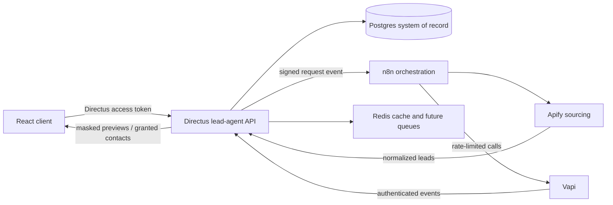

# Lead Agent Architecture

## System Flow

Directus owns identity, tenant boundaries, leads, wallet accounting, call artifacts, and audit events. n8n coordinates external work but is never the source of truth. If an n8n execution fails, the Directus request and outbox event remain available for retry.

## Request Lifecycle

1. A verified customer submits a lead segment. Directus stores `lead_requests` and `integration_events` in one transaction.
2. Directus sends the signed event to the active n8n webhook. A missing workflow leaves the request queued.
3. n8n runs the configured Apify actor, caps the result count, and normalizes its output.
4. Directus fingerprints each result, updates or creates the canonical lead, and links it to the customer request.
5. n8n starts Vapi calls at a controlled rate and registers each provider call ID in Directus.
6. Vapi posts status and end-of-call events directly to Directus. Duplicate events are ignored.
7. Customers see masked results. A reveal creates an immutable 1 SAR debit and a durable access grant in one database transaction.

## Capacity Target

The initial topology is intentionally simple and is more than sufficient for 100 newly active users per month:

- One Directus instance with Postgres 16 and Redis.
- One n8n instance using the Postgres `n8n` schema.
- Up to 100 leads per request at the API boundary; the current product UI requests 20.
- Vapi creation throttled to one call every two seconds in the workflow template.
- Unique indexes for phone, lead fingerprint, provider call/event IDs, ledger idempotency, and access grants.

Before launch, run a load test against the expected request mix rather than treating user count as the only sizing signal. Call concurrency and provider limits will become bottlenecks before Postgres does.

## Scaling Path

At sustained volume, keep the API contract and change the runtime:

1. Enable n8n queue mode and add workers backed by Redis.
2. Put Directus behind a reverse proxy with two stateless instances and a shared cache.
3. Move recordings to private object storage with signed URLs and retention rules.
4. Add an outbox retry worker and a dead-letter view in Directus.
5. Partition or archive old `call_events` and provider payloads after the agreed retention window.
6. Add database backups, restore drills, metrics, structured logs, and provider-cost alerts.

## Security And Data Handling

- Use different random secrets for Directus, n8n callbacks, Vapi webhooks, OTP hashing, and n8n encryption.
- Keep provider keys server-side. The browser only receives short-lived Directus access tokens and refresh tokens.
- Configure Vapi with an `X-Vapi-Secret` custom credential and HTTPS only.
- Restrict call access by workspace; transcripts and recordings stay private by default.
- Obtain legal review for Saudi PDPL obligations, sourcing rights, marketing consent, call recording disclosure, retention, deletion, and cross-border providers before production calls.
